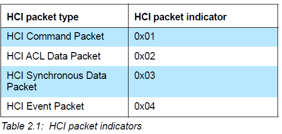

# NimBLE HCI 层对接 RT-Thread UART

本文主要介绍如何使用 RT-Thread UART 对接 NimBLE 中 Host 端的 HCI 传输层，实现 `RT-Thread NimBLE Host` 与 `BLE Controller` 使用串口进行通信的场景。

## RT-Thread UART 的使用

首先看一下[官方文档-UART 设备](https://www.rt-thread.org/document/site/#/rt-thread-version/rt-thread-standard/programming-manual/device/uart/uart_v1/uart) ，了解一下 RT-Thread 中 UART 设备的管理及使用。
主要是处理好串口初始化、串口发送部分、串口接收部分。

1.  串口初始化

    通过串口名称查找串口设备、控制串口设备（配置工作参数等）及 打开串口设备。

2.  串口发送部分

    使用 `rt_device_write()` 向已打开的串口设备中写入数据，串口则会发送出去。

3.  串口接收部分

    这一部分比较灵活，可以打开串口设备前，使用 `rt_device_set_rx_indicate()` 设置接收回调函数；也可以使用轮询方式，设置专用的线程进行串口数据接收处理。

## 对接思路

依据这篇分析文章 - [对 NimBLE HCI 层分析](https://club.rt-thread.org/ask/article/35d46365ec589940.html) ，在 rt-thread uart 框架下进行对接。这里刚好与 hci_uart.c 例程相反，主要是实现 Host 侧 HCI 层，主体框架如下：

1.  需要用的统一的串口发送接口。
2.  需要具体实现向使用串口向 ll 端发送 cmd 和 acl 包的接口：`ble_transport_to_ll_cmd_impl` 、`ble_transport_to_ll_acl_impl `。
3.  如何接收从 ll 端传来的数据： 还是使用官方提供的 `hci_h4_sm`，接收串口数据，组帧后自动调用回调函数，并且分类后使用 `ble_transport_to_hs_evt` 和 `ble_transport_to_hs_acl` 传递给 Host。

## 统一的串口发送接口

使用 rt_device_write() 接口发送串口数据，并确保 buf 中所有数据都能够通过串口发送完毕。

```c
// UART send data
static void rtthread_uart_tx(const uint8_t *buf, size_t len)
{
    size_t remaining = len;
    size_t tx_size = 0;

    while (remaining > 0) {
        tx_size = rt_device_write(g_serial, 0, buf, remaining);
        buf += tx_size;
        remaining -= tx_size;
    }
}
```

## HCI 包发送接口

由于当前为 Host 侧，则需要实现向 Controller 端发送的 cmd 及 acl 包的接口。

### HCI 包

看一下 Bluetooth Spev Core 5.0 的官方文档中对 UART HCI 包的描述：



且文档中明确表示：`HCI Command Packets` 只能由 Host 发向 Controller；`HCI Event Packets` 只能由 Controller 发向 Host；而
`HCI ACL/Synchronous Data Packets` 可以双向发送。

紧接着就说了 HCI 包的发送形式：首先必须发送 `HCI packet indicator`， 其实也就是这里的 TYPE 标识；且 `indicator` 也可紧接着刚发送完的完整 HCI 包发送。

### ble_transport_to_ll_cmd_impl 实现

Vol2 Part.E 5.4.1 小结介绍了 `HCI command packet` 的格式， `HCI command packet` 前3个字节为 `HCI packet header`：头两个2个字节为标识码，用来标识不同类型的包；后一个字节为参数总长度。接着后面的字节为所有的参数信息，不同的命令有不同的参数信息，这个不过多关注。


接口中 Host 提供包的 buffer 指针，据此主要获取 HCI Command Packet 中长度信息得知数据包总长度，先发送一字节 indicator `HCI_H4_CMD`，然后获取 buf 中 `Parameter Total Length` 字段得到需要发送 cmd packet 的总长度为 buf[2] + 3 (header)。

接着发送 Packet 所有内容即可。

```c
int ble_transport_to_ll_cmd_impl(void *buf)
{
    uint8_t indicator = HCI_H4_CMD;
    uint8_t *cmd_pkt_data = (uint8_t *)buf;
    size_t pkt_len = cmd_pkt_data[2] + 3;  // parameter_len + header_len(3) 
    
    rtthread_uart_tx(&indicator, 1);  // send indicator
    rtthread_uart_tx(cmd_pkt_data, pkt_len);  //send cmd pkt data

    ble_transport_free(buf);  //free hci pkt 

    return 0;
}
```

### ble_transport_to_ll_acl_impl 实现

HCI ACL Data Packet，用于 Host 与 Controller 之间交换数据。HCI ACL 数据包头是数据包的前4个字节：前两个字节包含句柄以及标志位；后两个字节是数据字段的总长度。


但此处接口中 Host 提供 `os_mbuf` 形式的数据 buffer ，因此有必要稍微了解一下 `struct  os_mbuf` ， 其声明在`porting\nimble\include\os\os_mbuf.h`  中，依据注释可以简单知道，这是一个**链式**内存 buffer 结构，结构体中除了保存当前 buffer 信息外，还有指向下一个 `os_mbuf` 的信息，就是一个单链表形式，说明这一个 acl packet 的 data 可能分散在几个 os_mbuf 结构中，以链表形式组织。
所以需要按照链表顺序从头往尾依次把所有 `os_mbuf` 中的数据发送出去。当然首先要发送 indicator： HCI_H4_ACL。

```c
int ble_transport_to_ll_acl_impl(struct os_mbuf *om)
{
    uint8_t indicator = HCI_H4_ACL;

    rtthread_uart_tx(&indicator, 1);  // send indicator

    // single-list, send all node data
    struct os_mbuf *x = om;
    while (x != NULL)
    {
        rtthread_uart_tx(x->om_data, x->om_len);
        x = SLIST_NEXT(x, om_next);
    }
    
    os_mbuf_free_chain(om); // free os_mbuf chain

    return 0;
}
```


## HCI 包接收处理

此处构建 UART 接收 HCI 包的机制，需要从 UART 接收 Controller 端传输来的 HCI 包，包括 evt 和 acl 包。

在之前的 HCI 层分析文档中提到，官方提供了 `hci_h4.h` 中的接口进行数据接收后的判断以及自动组包。

-   直接使用 `hci_h4_sm_rx` 接口接收 UART 中的数据。
-   注册 `hci_uart_frame_cb` 为包处理回调函数；分别处理 evt 和 acl 类型的包，并分别传递给 Host 。

### 接收 UART 数据

考虑到使用 `hci_h4_sm` 接收数据后，会自动调用相应回调函数，这样会导致接收回调函数调用太多且臃肿，所以这里不打算使用中断方式接收字符；而是单独开一个轮询线程，不断轮询串口设备接收到的信息，然后使用 `hci_h4_sm_rx()` 接收数据后进行处理。

```c
/* hci_h4 rx instance  */
struct hci_h4_sm g_hci_h4sm;

// uart rx thread
static void rtthread_uart_rx_entry(void *parameter)
{
    uint8_t data[64];
    size_t data_len;
    while (1) {
        data_len = rt_device_read(g_serial, 0, &data, 64);
        if (data_len > 0) {
            hci_h4_sm_rx(&g_hci_h4sm, data, data_len);
        }
    }
}
```

### HCI 包处理回调函数

编写对应的回调函数，这里按照之前的 `hci_uart.c` 例程修改即可。只不过这里 HCI 包类型是 evt 和 acl，以及需要往 Host 发送。

```c
static int hci_uart_frame_cb(uint8_t pkt_type, void *data)
{
    switch (pkt_type) {
    case HCI_H4_EVT:
        return ble_transport_to_hs_evt(data);
    case HCI_H4_ACL:
        return ble_transport_to_hs_acl(data);
    default:
        assert(0);
        break;
    }
    return -1;
}
```

接着使用以下初始化接口，注册回调函数即可。

```c
void hci_h4_sm_init(struct hci_h4_sm *h4sm, 
                    const struct hci_h4_allocators *allocs, 
                    hci_h4_frame_cb *frame_cb)
```

## 总结

到这里依据分析文档，使用 rt-thread UART 对接 NimBLE 的 HCI 层就实现完毕了。此时 rt-thread 上跑 Host 端，因此要将 NimBLE 的 Controller 功能关闭，将不编译 Controller 相关代码。