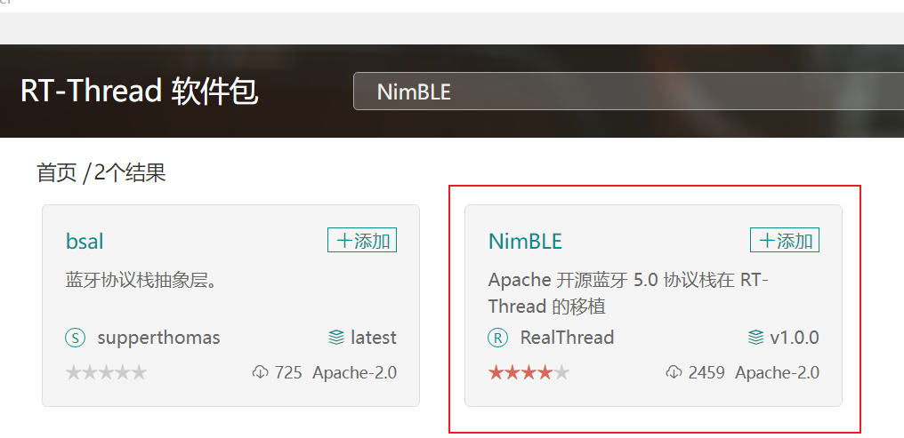
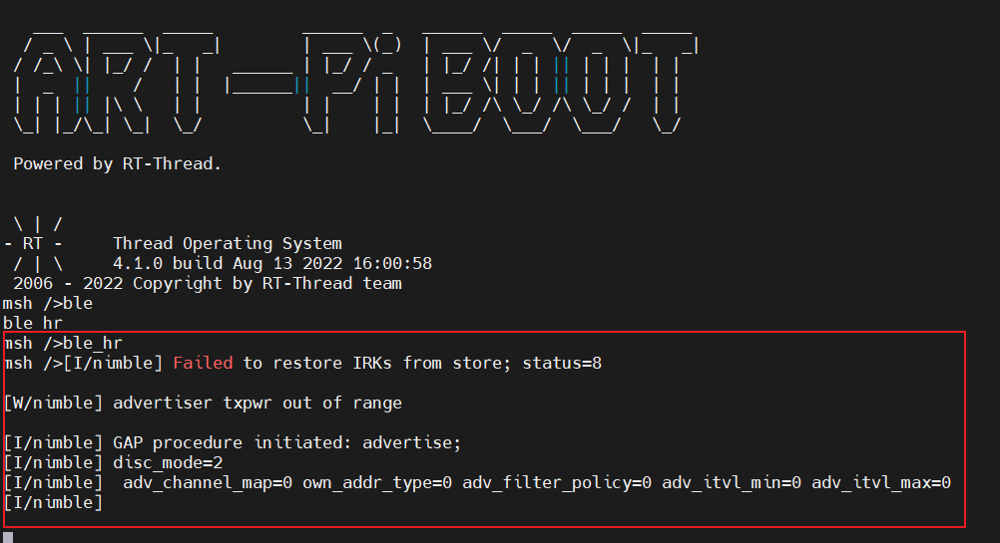
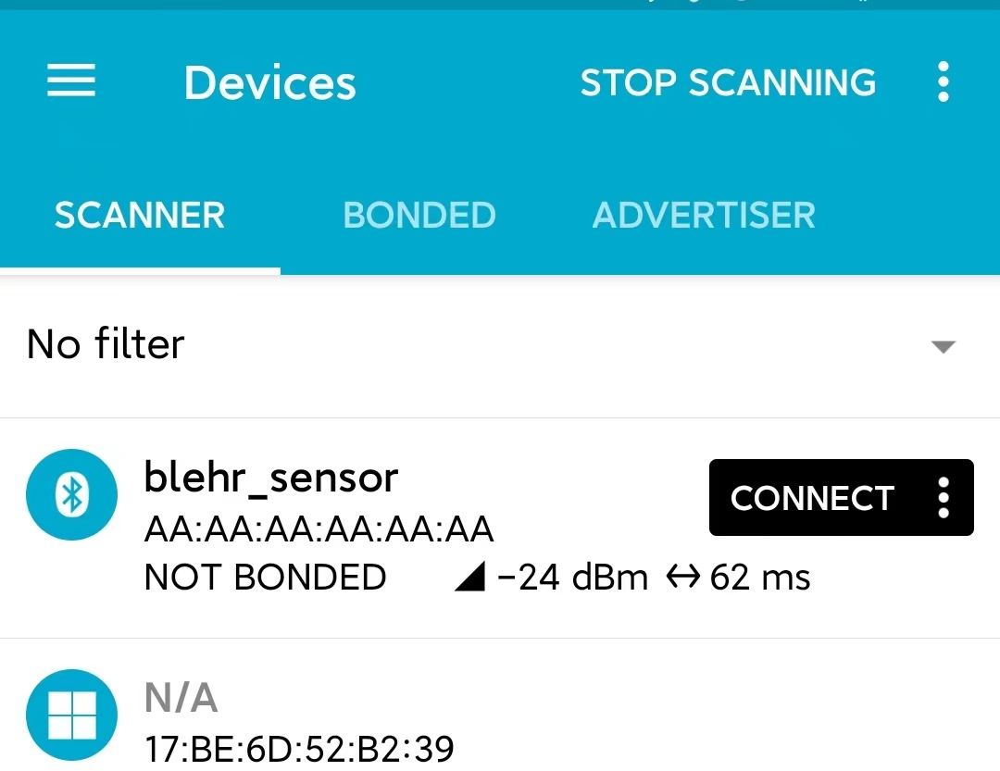
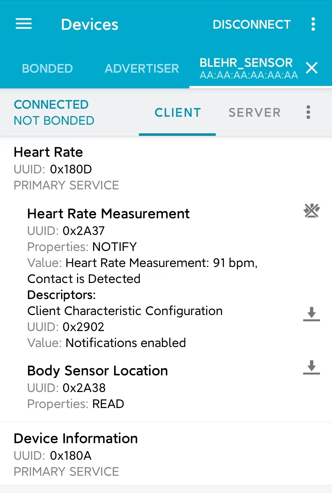

# NimBLE 使用说明

本文主要介绍 NimBLE 软件包的使用

-   RT-Thread Studio 工程中配置使用 NimBLE

-   BSP 下工程配置使用 NimBLE

目前 NimBLE 支持 BLE Host 层，还需要搭配外接蓝牙 Control 芯片使用。

## RT-Thread Studio 工程中配置使用 NimBLE

进入工程 RT-Thread Settings 界面， 点击添加软件包


在软件包中心找到 NimBLE ，并点击添加



添加完成后关闭界面，这时可以在 RT-Thread Setting 中看到 NimBLE 软件包：


软件包添加完成。

添加完成后还需要进行一些配置，点击软件包的**配置项**，进入详细配置界面


按照以下步骤进行配置：

1、关闭 Controller 支持： 将 **Controller Configuration - Bluetoorh Controller support** 关闭；

2、打开 HCI Transport 支持，并配置相关使用的串口： 将 **HCI Transport support - HCI Transport using rt-thread uart** 打开， 并且 修改 **The uart for HCI Transport** 为实际与蓝牙Control卡片连接的串口，如 uart3。

3、选择使用相应的蓝牙例程：在 **Bluetooth Samples** 中选择相应的例程。目前支持以下几个例程：

-   BLE peripheral heartrate sensor
-   BLE peripheral cycling speed and cadence sensor
-   BLE central role sample
-   BLE peripheral role sample
-   BLE beacon sample
-   BLE advertiser sample

4、选择最新版本代码： 在 **Version** 中选择 “latest”。

最终配置结果如下图：


配置完成后保存，studio 将自动更新下载软件包。


## BSP 工程中配置使用 NimBLE

在某一 bsp 工程下打开 `env` 工具， 输入 `menuconfig` 进行配置

1、进入 RT-Thread online packages → IoT - internet of things 目录即可看到 NimBLE 软件包，勾选软件包


2、进入 Controller Configuration **关闭** NimBLE Controller 支持


在 RT-Thread 上 NimBLE 不需要运行 Controller ，使用 蓝牙 Control 芯片代替。

3、配置 NimBLE HCI 层支持，选择实际用于连接蓝牙 Control 芯片的串口，如 “uart3”。


4、选择使用相应的蓝牙例程：在 **Bluetooth Samples** 中选择相应的例程。


目前支持以下几个例程：

-   BLE peripheral heartrate sensor
-   BLE peripheral cycling speed and cadence sensor
-   BLE central role sample
-   BLE peripheral role sample
-   BLE beacon sample
-   BLE advertiser sample

5、选择最新版本代码： 在 **Version** 中选择 “latest”。


配置完成后保存。

6、使用 `pkgs --update` 命令下载 NimBLE 软件包到 BSP 目录下的 packages 文件夹里。

```shell
$ pkgs --update
```


## 编译运行

1、这里使用 RT-Thread Studio 下 ART-Pi 开发板的示例工程 ` art_pi_blink_led ` 进行演示，添加和配置完成NimBLE软件包后，编译完成烧写到板子上运行。

2、串口连接蓝牙 Control 芯片（这里直接使用 ART-Pi 板载的 AP6216 芯片）。关于其他蓝牙控制器选择可以参考 [蓝牙控制器固件](https://github.com/RT-Thread-packages/nimble/tree/master/docs/firmwares) （或 NimBLE 软件包目录下 /docs/firmwares/README.md）。

3、连接串口终端，可以使用 `hlep` 看到 BLE 相关例程命令，运行即可，可以看到相关日志输出



使用 **nRF Connect** 手机 APP 即可成功观察到蓝牙设备，名称为 **blehr_sensor** ：




 点击连接后，在 CLIENT 下即可看到 Heart Rate 相关数据。



