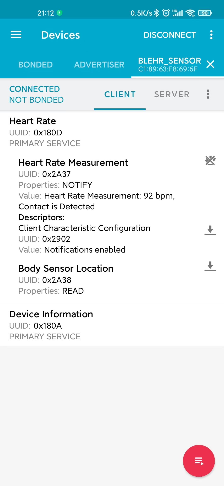

# QEMU 环境运行 NimBLE

NimBLE 可在 QEMU 环境下搭配蓝牙 Control 芯片运行，目前在 Ubuntu 18.04 下运行成功。

## QEMU 环境搭建

主要参考 [在 Ubuntu 平台开发 RT-Thread](https://www.rt-thread.org/document/site/#/rt-thread-version/rt-thread-standard/application-note/setup/qemu/ubuntu/an0005-qemu-ubuntu?id=在-ubuntu-平台开发-rt-thread) 文档中步骤搭建 qemu 环境。

**注意**：若 scons 版本低于 v4.0.1，需要手动安装 scons，步骤如下：

```shell
git clone -b 4.0.1 https://github.com.cnpmjs.org/SCons/scons.git
cd scons
sudo python3 setup.py install
```

## 配置 NimBLE 软件包

1、在 qemu-vexpress-a9 BSP 根目录输入：

```shell
scons --menuconfig
```

2、进入 RT-Thread online packages → IoT - internet of things 目录即可看到 NimBLE 软件包，勾选软件包。


3、进入 Controller Configuration **关闭** NimBLE Controller 支持


在 RT-Thread 上 NimBLE 不需要运行 Controller ，使用 蓝牙 Control 芯片代替。

4、配置 NimBLE HCI 层支持，选择用于连接蓝牙 Control 芯片的串口吗，这里 The uart for HCI Transport 默认输入 "uart1" 就好。


5、选择相应的蓝牙 App 例程


这里选择 “BLE peripheral heartrate sensor” 即可。

6、选择软件包版本为 “latest”。

配置完成如下：


保存后退出。

## 下载软件包

使用 `scons --menuconfig` 命令后会安装及初始化 Env 工具，并在 home 目录下面生成 “.env” 文件夹，此文件夹为隐藏文件夹，切换到 home 目录，使用 `ls` 命令可查看所有目录和文件。

```
$ ls ~/.env
env.sh  local_pkgs  packages  tools
```

运行 env.sh 会配置好环境变量，让我们可以使用 `pkgs` 命令来更新软件包，执行

```
$ source ~/.env/env.sh
```

使用 `pkgs --update` 命令下载 NimBLE 软件包到 BSP 目录下的 packages 文件夹里。

```
$ pkgs --update
```

## 编译与运行

1、在 qemu-vexpress-a9 BSP 目录下输入 `scons` 命令编译工程，等待编译完成会生成 rtthread.bin 文件。

2、连接蓝牙 Control 芯片（使用 nrf52840dk 进行演示，将其 JLink 接口连接电脑），关于蓝牙控制器选择可以参考 [蓝牙控制器固件](https://github.com/RT-Thread-packages/nimble/tree/master/docs/firmwares) （或 NimBLE 软件包目录下 /docs/firmwares/README.md）。

**注意：**如使用 nrf52840dongle 及类似的蓝牙控制器，还需要参考 [QEMU 环境运行 BLE](https://www.rt-thread.org/document/site/#/rt-thread-version/rt-thread-standard/application-note/setup/qemu/qemu-ble/qemu_ble?id=qemu-环境运行-ble) 进行环境搭建，并运行。

3、在 qemu-vexpress-a9 BSP 目录下执行以下命令运行 qemu 虚拟机，将 rt-thread 跑起来:

```shell
qemu-system-arm -M vexpress-a9 -smp cpus=2 -kernel rtthread.bin -nographic -sd sd.bin -serial mon:stdio -serial /dev/ttyACM0
```

**注意:** “/dev/ttyACM0” 可以按照实际连接时串口设备名进行调整。

4、rt-thread 启动后，在 msh 命令行输入 `ble_hr` 命令即可运行 BLE 例程，实际运行现象如下：


使用 **nRF Connect** 手机 APP 即可成功观察到 qemu 程序发送的广播包，名称为 **blehr_sensor** , 点击连接后，在 CLIENT 下即可看到 Heart Rate 相关数据。

| 找到 blehr_sensor                                  | 连接 blehr_sensor 即可观察到相关信息                       |
| -------------------------------------------------- | ---------------------------------------------------------- |
|  |  |


