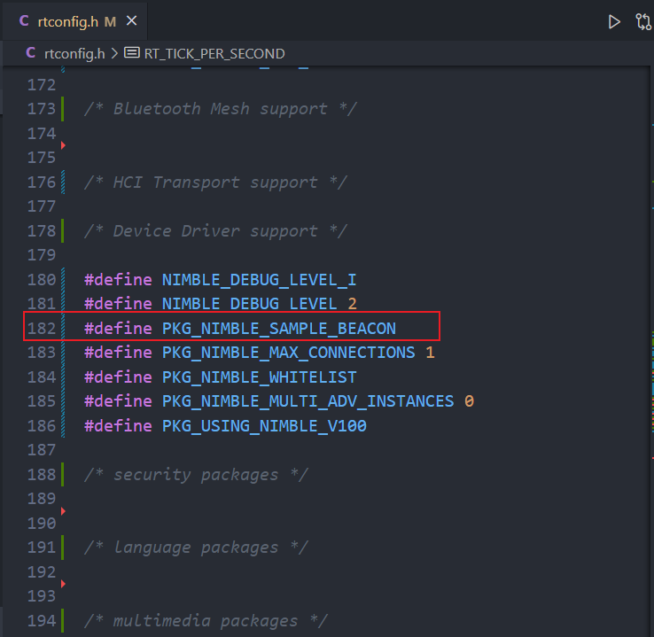

# menuconfig 之后发生了什么?

最近在学习 RT-Thread 中的 NimBLE 软件包，使用 menuconfig 配置选中 NimBLE 软件包，设置各种选项后，成功通过编译并且运行起来。不过这仅仅只是按照文档说明运行了起来，鉴于后面可能会修改 menuconfig 中配置的结构，因此大概分析了一下 RT-Thread 编译构建的机制。

## 官方文档

关于 RT-Thread 构建与配置的机制，其实官方文档中已经有了一些描述，不过这些描述放在首页的 **开发工具**  标签下，不好被发现。


可以先看看官方文档，对 [RT-Thread 构建与配置系统](https://www.rt-thread.org/document/site/#/development-tools/build-config-system/summary) 进行大概的了解。

## 配置工具 - Kconfig

Kconfig 是一个管理配置的机制，源于Linux内核的配置构建系统，通过条件编译和宏来裁剪功能，将一些不必要的C语言代码在预处理阶段就屏蔽掉，减少需要编译的代码；当然也可以用来做选择。

主要包括 Kconfig 文件以及 UI 配置界面，menuconfig 就是一个 UI 配置界面。menuconfig 是依据 Kconfig 中的规则分析出构建选项目录显示给我们进行选择；也就是说如果想修改 menuconfig 中显示的内容，是可以通过修改 Kconfig 内容实现的，具体的语法还是看一下官方文档([Kconfig 语法示例](https://www.rt-thread.org/document/site/#/development-tools/build-config-system/Kconfig?id=kconfig%e8%af%ad%e6%b3%95%e5%8f%8a%e7%a4%ba%e4%be%8b))介绍。

当选择完成后，选择的配置会记录在 .config 文件中，修改选项后 `save` 或者 `exit` 都可看到写入 .config 文件的提示信息。


 .config 中的保存的内容会同步到 rt_config.h 中自动生成一些宏（rt_config.h 就是整个 RT-Thread 的配置文件，在其中通过宏定义一些参数等等）。关于同步 .config 中信息到 rt_config.h 的过程，有兴趣的话可以分析一下 rt-thread/tools/menuconfig.py 脚本文件，里面是 menuconfig 的 python 代码，包括了显示 GUI 以及对 .config 和 rt_config.h 文件的操作。


**实际过程分析：**

当在 menuconfig 中选中 RT-Thread online packages -> IoT - internet of things 下的 NimBLE 软件包后，保存退出。

.config 文件中增加了 NimBLE 相关的内容：


而在 rt-config.h 中也自动增加了 NimBLE 相关的宏定义。


而这些宏会作用到 NimBLE 软件包中对应的地方，例如这其中的 PKG_NIMBLE_CTLR 宏是配置蓝牙 controller 功能的选项，当其没有被定义时，NimBLE 软件包中蓝牙 controller 部分功能则会被屏蔽失效。

还有一些宏可以用于定义运行参数，例如栈大小、线程优先级等，关于 RT-Thread 内核的一些参数也定义在 rt_config.h 中，在menuconfig 中对于内核的配置也会最终映射到此处。

关于配置相关就说到这，接着看一下实际构建项目的工具。


## 构建工具 - SCons

[SCons官方介绍](https://www.rt-thread.org/document/site/#/development-tools/build-config-system/SCons)

RT-Thread 使用 Scons 为构建工具的唯一目的就是让开发者更容易开发功能，去除 Make 繁琐的语法过程。Scons 主要是由 python 语言构成，除了构建功能外也能完成 python 的一些功能，比较灵活。

Scons 的基本命令和函数等等都在官方文档里有介绍，这里也不再赘述。主要看一下分层构建，引用官方文档：

>   SCons 使用 SConscript 和 SConstruct 文件来组织源码结构并进行构建，SConstruct 是 scons 构建的主脚本；SConscript 存放在源代码的子目录下，通常放在项目的子目录，以达到分层构建的目的。

SConstruct 主要是关于编译环境，编译参数的一些配置描述；SConscript 则是组织对应子目录的编译情况，具体的构建语句可以结合官方文档或者自行百度分析。

一个很直观的功能，就是依据代码中的 宏定义 来判断构建哪些源文件，主要使用 `GetDepend()` 函数获取宏定义状态。以 NimBLE 软件包为例子，在软件包目录中的 SConscript 中会涉及到上一章节说到配置相关宏定义：


可以看到，如果在 menuconfig  中开启了 蓝牙 Controller 功能，则 PKG_NIMBLE_CTLR 宏是会被定义在 rt_config.h 中的，那么在编译构建过程中，这里的 GetDepend() 是可以检测到相关宏定义的，也就会依据下面的代码将 Controller 相关源码文件加入编译。

软件包中 BLE 相关的例程也是通过这个方式进行选择编译的，在 menuconfig 中选中 beacon 例程，rt_config.h 中生成相关宏定义，编译时就只会将 beacon 例程相关源文件加入编译。

|                      rt_config.h                       |                       SConscript                       |
| :----------------------------------------------------: | :----------------------------------------------------: |
|  |  |

基于这些功能，SCons 搭配 Kconfig 实现项目的配置裁剪构建。初此之外，SCons 还有很多灵活性的功能，官方文档中都有提到。


## 一体化开发工具 - Env

>   Env 是 RT-Thread 推出的开发辅助工具，针对基于 RT-Thread 操作系统的项目工程，提供编译构建环境、图形化系统配置及软件包管理功能。

[Env-用户手册](https://www.rt-thread.org/document/site/#/development-tools/env/env)

前面说的 menuconfig 以及 SCons 工具 RT-Thread 官方都给你打包好了，集成在 Env 环境中。这也是为什么每次都要打开 Env 环境进行配置构建。

每次使用一个 bsp 工程时，menuconfig  完成之后，还需要根据选项配置将特定的代码（如添加软件包等）通过 `pkgs --update` 命令进行拉取或者更新到本地。这也就涉及到 RT-Thread 提供的软件包管理功能，搭配 menuconfig 配置功能，软件包代码的下载、更新和删除 都可以使用 `pkgs --update` 命令。


### 软件包的 Kconfig

值得一提的是，一般在 bsp 下 Kconfig 文件中看不到具体的配置内容，而是通过数个部分分散到不同目录的 Kconfig 文件中，bsp 下 Kconfig 文件一般都是如下编写：

```
mainmenu "RT-Thread Configuration"

config BSP_DIR
    string
    option env="BSP_ROOT"
    default "."

config RTT_DIR
    string
    option env="RTT_ROOT"
    default "../../.."

config PKGS_DIR
    string
    option env="PKGS_ROOT"
    default "packages"
    
...
source "$RTT_DIR/Kconfig"
source "$PKGS_DIR/Kconfig"
```

从上面可以看出主要是定义了 3 个路径：

-   BSP 当前路径
-   rt-thread 的根路径。
-   packages 的路径，是指 env 工具目录下的 packages 目录。

以及使用 `source` 读取 2 个路径下的 Kconfig 文件，主要是看 `$RTT_DIR/Kconfig` 和`$PKGS_DIR/Kconfig`：

-   前者是 rt-thread 源码根路径下的 Kconfig 用于与其他组件的 Kconfig 关联起来。
-   后者不是指的 bsp 目录下的 packages 目录，而是 env 环境下的 packages 目录，这里不要弄混了；bsp 下的  packages 目录只是选中软件包后拉取下来的软件包源码，在里面是没有 Kconfig 文件的。而 env 工具目录下也有一个 packages 目录，里面就有 这里指的 `$PKGS_DIR/Kconfig` 文件，用于软件包配置使用，也作用于拉下来的 软件包源码配置与构建。


## 总结

最后总结一下，当运行一个 bsp 时，基本的流程都如下：

1.  在 bsp 路径下**打开 Env 工具**。
2.  **配置工程** ：使用`menuconfig` 将一些组件进行图形化的选择，对整体工程进行添加或者裁剪。（作用于 .config 文件，自动映射到 rt_config.h 文件，定义相关宏，完成配置）
3.  **软件包代码的更新** ：如果使用到了软件包，则需要 `pkgs --update` ，主要是依据 menuconfig 配置结果，更新相关软件包代码。
4.  **构建工程**：使用 `SCons` 进行项目的构建， 实际构建动作基于 SConscript 和 SConstruct 文件中的规则，也与 rt_config.h 文件相关(编译裁剪的落地)。

上述过程就构成一次 RT-Thread 配置构建的过程，最终生成的二进制文件可以烧录到目标板上运行。

可以看出后续的软件包更新以及项目构建过程，都依赖于开发者在 menuconfig 中的配置，通过 .config 和 rt_config.h 文件进行配置的传递。

