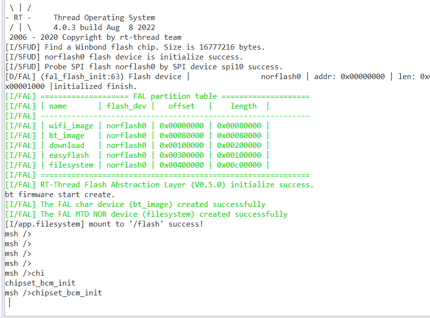
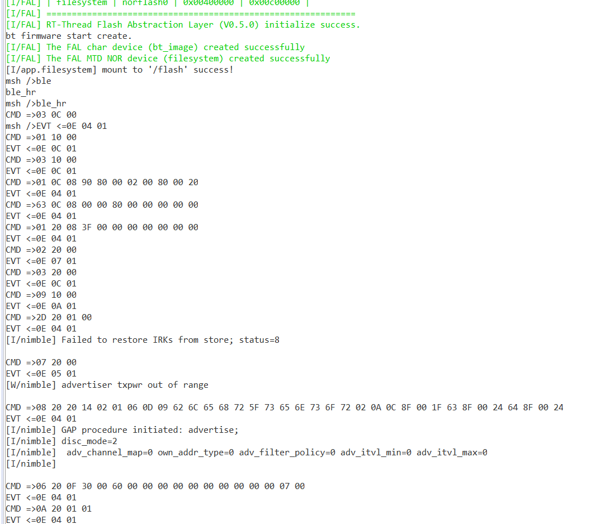
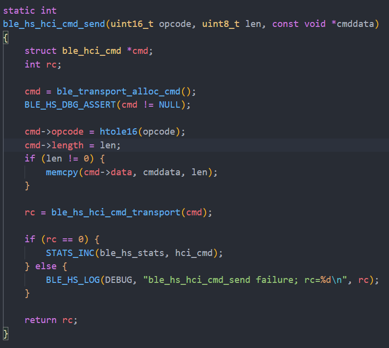
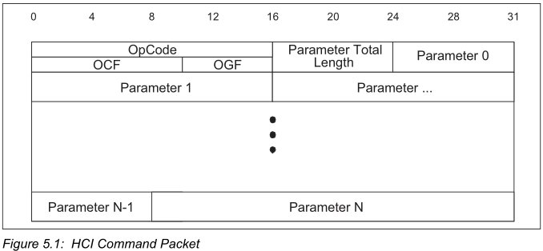
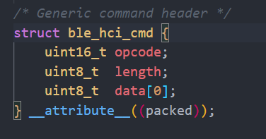
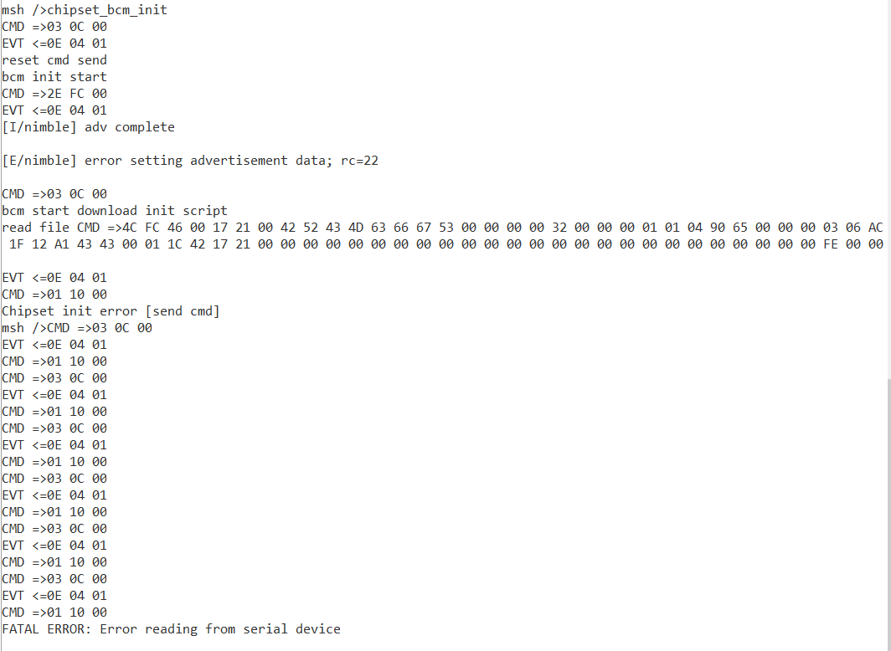

# Task 5 问题描述

## 问题一

ART-Pi 初始化代码需要读取 hcd 文件，而 hcd 存储在  bt_image 分区。之前将 bt_image 分区挂载成字符设备， open 正常打开，但是 read 时就会报错卡死。

**解决：**

按照 ART-Pi SDK 中仓库里的 文档，将整个 数据 flash 重新刷了一遍，就可以正常读文件了。


## 问题二

为了debug 临时在 HCI 层对接代码中加入了 CMD 和 EVT 包的打印，直观看到 HCI 包数据。


当前使用 NimBLE 的 Host 端接口 发送 hci cmd



使用命令方式启动初始化代码，发现会阻塞。 

后面发现，此时NimBLE HCI 层发送和接收必须要在 Host 运行起来后才能正常， 要先 启动例程将 HOST 端拉起来运行才可以正常使用 HOST 中 hci 发送接口。




是否要把初始化的程序，嵌入到 Host  startup 的过程中。


## 问题三

AP6212 按理说每次上电都需要初始化操作才能正常使用，但是我在 ART-Pi 上直接使用 NimBLE 软件包，配置 hci 串口为 uart3。

直接就能跑例程了，我也不明白为啥能这样。


## 问题四

目前使用这个接口进行传输

`int ble_hs_hci_cmd_tx(uint16_t opcode, const void *cmd, uint8_t cmd_len, void *rsp, uint8_t rsp_len)`

这里传入的参数貌似不是单纯的 hci cmd 的包数据，需要处理一下



和下面的包结构对应：



 CMD Header 包括 OpCode 和 Length。




由于我们是从 文件中一条一条读出来的， 所以使用 `int ble_hs_hci_cmd_tx(uint16_t opcode, const void *cmd, uint8_t cmd_len, void *rsp, uint8_t rsp_len)` 的时候好像还要处理一下，而且传入 头部数据 opcode 和 cmd_len， 后面的数据部分 由 *cmd 传入。


```
// reset 指令如下：
static uint8_t hci_reset_cmd[] = {0x03, 0x0C, 0x00};

// opcode 要处理一下
uint16_t opcode = hci_reset_cmd[1];
opcode = (opcode << 8) + hci_reset_cmd[0];
```


目前 hcd 文件中的 cmd 包 发送还有问题， 且针对 问题3 中的现象， 在我初始化代码发送 reset 和 download 指令后，除了我发送的 reset 指令，应该还有 Host 发送的指令： 01 10 00 这个我不清楚。

感觉像是 ble hr 例程和 chipset_bcm_init 有冲突了

