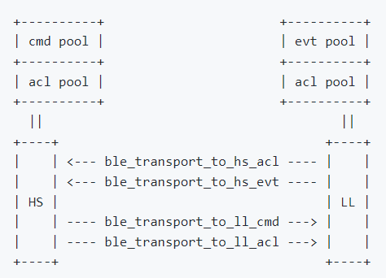

# NimBLE HCI 层分析

本文主要分析了 [Apache NimBLE](https://github.com/apache/mynewt-nimble) v1.5 版本的 BLE HCI 层设计，并分析了官方仓库自带 UART 对接例程；关于 BLE 层次结构可以先看一下这篇[参考文档](https://supperthomas-wiki.readthedocs.io/en/latest/ble/00_ble_introduce/BLE_introduce.html#id2)。

## NimBLE 目录结构

```
NimBLE
   ├───apps                   /* Bluetooth 示例应用程序 */
   ├───docs                   /* 官方文档及 API 说明 */
   ├───ext
   ├───nimble
   │   ├───controller         /* Controller 实现 */
   │   ├───doc                /* 当前包含 transport 层说明文档 */   
   │   ├───drivers            /* Nordic 系列 Phy 驱动 */
   │   ├───host               /* Host Stack(主机控制器)实现 */
   │   ├───include
   │   └───transport          /* HCI 传输抽象层 */
   └───porting                /* OS 抽象层及系统配置 */
```

-   观察目录，可以看出 NimBLE 是实现了 Host 与 Controller 分离的，在[官方介绍](https://github.com/apache/mynewt-nimble)中也有说明。
-   nimble 的 Host 可以跑在任一芯片上；Controller 则限制比较多，需要有特殊的硬件以及驱动支持。
-   `nimble/controller` 则是 Controller 相关代码； `nimble/host` 对应 Host 代码； `nimble/transport` 就是 HCI 层代码；这一版本 `nimble/doc` 下还包含了 HCI 层的说明文档 `transport.md`。
-   顺带一提，porting 目录下是 OS 抽象层及系统配置； rt-thread 的移植就实现在 `porting/npl` 下。

## NimBLE HCI 层

>   主机控制接口层（Host Controller Interface，简写 HCI）：HCI是可选的，主要用于2颗芯片实现BLE协议栈的场合（一个当作 Host 一个当作 Controller），用来规范两者之间的通信协议和通信命令等。

NimBLE HCI 层主要是了解 `nimble/transport` 下的内容。首先看一下官方文档 `nimble/doc/transport.md` 中对 transport 层的说明，主要看下面这张图：



HCI 层包括这4接口：Host 从 Controller 端接收接口 `ble_transport_to_hs_evt` 和 `ble_transport_to_hs_acl`；以及 Host 向 Controller 发送接口 `ble_transport_to_ll_cmd` 和 `ble_transport_to_ll_acl`。

在目录下，官方流出的接口定义主要包含在下面几个文件中：

```
transport
   └───inlucde
       ├───nimble
       │   └───transport
       │       └───monitor.h
       ├───transport_impl.h
       └───transport.h
```

其中比较重要的是 `transport_impl.h` 文件，从名字也可以看出这是一个需要实现的接口定义文件，其主要内容如下：

```c++
/* Init functions to be implemented for transport acting as HS/LL side */
extern void ble_transport_ll_init(void);
extern void ble_transport_hs_init(void);

/* APIs to be implemented by HS/LL side of transports */
extern int ble_transport_to_ll_cmd_impl(void *buf);
extern int ble_transport_to_ll_acl_impl(struct os_mbuf *om);
extern int ble_transport_to_hs_evt_impl(void *buf);
extern int ble_transport_to_hs_acl_impl(struct os_mbuf *om);
```

这些接口在 `transport\include\nimble\transport\monitor.h` 中被引用：

```c++
static inline int
ble_transport_to_ll_cmd(void *buf)
{
    return ble_transport_to_ll_cmd_impl(buf);
}

static inline int
ble_transport_to_ll_acl(struct os_mbuf *om)
{
    return ble_transport_to_ll_acl_impl(om);
}

static inline int
ble_transport_to_hs_evt(void *buf)
{
    return ble_transport_to_hs_evt_impl(buf);
}

static inline int
ble_transport_to_hs_acl(struct os_mbuf *om)
{
    return ble_transport_to_hs_acl_impl(om);
}
```

看完这个文件，大概明白了，之前官方文档图中提到的 HCI 4个接口，在这里与对应的 *_impl() 接口绑定了起来。而 *impl() 接口就是官方提供给开发者具体实现对接的接口。

由于 Host 和 Contoller 是双向交互的，所以发送与接收 HCI 包接口是要完整实现的，也就是大多数情况下上述 4 个 *impl() 接口都需要全部实现。


## 分析 UART 对接 HCI 层官方例程

官方提供了一个使用 UART 对接 HCI 层的例程，源码文件为 `nimble/transport/uart/src/hci_uart.c` 

首先找到熟悉的接口：代码中显式实现了 `ble_transport_to_hs_evt_impl` 以及 `ble_transport_to_hs_acl_impl` ，这两个接口中基本上就是使用 uart 向 host 发送数据包，涉及到某个板子 uart 发送数据的具体细节，这里不过多关注。

看完上面两个接口，其实 HCI 中向 Host 发送数据包功能算实现完了，且当前文件中没有实现其他的 impl 接口，很容易能想到，这是写的 Controller 端的 HCI 层代码。

有了这个定性信息，可以开始分析如何从 uart 中接收 Host 层发来的数据包。

通过 uart 初始化函数找到 uart 接收回调函数：

```c++
// uart 初始化函数
rc = hal_uart_init_cbs(MYNEWT_VAL(BLE_TRANSPORT_UART_PORT),
                       hci_uart_tx_char, NULL,
                       hci_uart_rx_char, NULL);
```
```c++
// uart 接收回调函数
static int hci_uart_rx_char(void *arg, uint8_t data)
{
    hci_h4_sm_rx(&hci_uart_h4sm, &data, 1);
    return 0;
}
```

可以看到每接收一个字符，都使用 `hci_h4_sm_rx` 进行接收。该函数声明在 `transport\common\hci_h4\include\nimble\transport\hci_h4.h` 文件下，是关于 H4 的一个函数，大概看一下具体定义，接收字符后有一个组帧判断的过程。看一下 `hci_h4.h` 下比较关键的两个接口：

```c++
void hci_h4_sm_init(struct hci_h4_sm *h4sm,
                    const struct hci_h4_allocators *allocs,
                    hci_h4_frame_cb *frame_cb);

int hci_h4_sm_rx(struct hci_h4_sm *h4sm, const uint8_t *buf, uint16_t len);
```

`hci_h4_sm_init()` 中出现了一个 `hci_h4_frame_cb *frame_cb` 参数，这是一个函数指针参数，初步猜测用于回调函数的注册。且在

`hci_uart.c` 代码中，也找到了 `hci_h4_sm_init()` 相关调用：

```c++
244:  hci_h4_sm_init(&hci_uart_h4sm, &hci_h4_allocs_from_hs, hci_uart_frame_cb)
```

这里将 `hci_uart_frame_cb` 注册成了回调函数，源码中定义如下：

```c++
static int 
hci_uart_frame_cb(uint8_t pkt_type, void *data)
{
    switch (pkt_type) {
    case HCI_H4_CMD:
        return ble_transport_to_ll_cmd(data);
    case HCI_H4_ACL:
        return ble_transport_to_ll_acl(data);
    default:
        assert(0);
        break;
    }
    return -1;
}
```

`hci_uart_frame_cb`  基本上是对一个完整的 HCI 包的处理，根据不同的类型使用 `ble_transport_to_ll_cmd` 和 `ble_transport_to_ll_acl` 传输给 Link Layer 层( Link Layer 是 Controller 上的一个层次，更加确定这是 Controller 上的 HCI 层实现 )。

结合 `hci_uart.c` 中对 `hci_h4_sm` 的使用，以及对 `hci_h4_sm` 相关接口源码的分析，`hci_h4_sm` 其实是官方提供的一个类似保证包完整性的东西，用于判断一帧完整的 HCI 数据包，并且提供组包完成回调函数的机制。

看到这里，大概脉络应该已经捋清楚了。这是一个 Controller 上的 UART HCI 层对接实现：

1.  向 Host 发送 HCI 包：主要通过显式实现 `ble_transport_to_hs_evt_impl` 以及 `ble_transport_to_hs_acl_impl` 接口实现，具体何时被调用，协议栈已经自动处理好。
2.  从 Host 接收 HCI 包：主要是使用的 hci_h4 中的组包接口，hci_h4_sm 即一个组包的状态机实例，通过 `hci_h4_sm_rx` 接收 uart 接收到的字符，在判断 hci 包完整接收时调用提前注册好的 回调函数 `hci_h4_frame_cb` 。 `hci_h4_frame_cb` 里则实现了将 uart 接收到的包传递给 LL 层，进而 Controller 可以对 Host 传下来的命令或数据做出响应动作。


## 完整的 HCI 层实现

### Controller 使用 UART 做 HCI 层数据传输

开始说到无论在什么情况下都要完成 HCI 层中 4个主要接口的实现，当前  `hci_uart.c`  中只找到了两个接口的实现，还有另外两个接口在哪呢。使用全局搜索在 `nimble\controller\src\ble_ll.c` 下找到了另外两个接口的实现：

```c++
/* Transport APIs for LL side */

int
ble_transport_to_ll_cmd_impl(void *buf)
{
    return ble_ll_hci_cmd_rx(buf, NULL);
}

int
ble_transport_to_ll_acl_impl(struct os_mbuf *om)
{
    return ble_ll_hci_acl_rx(om, NULL);
}
```

因为目前默认在 Controller 端实现 HCI 层，剩下未实现的两个接口在 Controller 源码下实现了。


### Host 使用 UART 做 HCI 层数据传输

那么假设当前需要实现 Host 端的 HCI 层，且还是需要使用 UART 对接。那么需要实现对接 UART 的接口应该刚好和 `hci_uart.c` 中相反。

需要在对接源码中，实现 `ble_transport_to_ll_cmd_impl` 和 `ble_transport_to_ll_acl_impl` 发送接口，具体同样也是使用 UART 发送包。相应的，在 `nimble\host\src\ble_hs.c` 下找到了以下两个接口的实现：

```c++
/* Transport APIs for HS side */

int
ble_transport_to_hs_evt_impl(void *buf)
{
    return ble_hs_hci_rx_evt(buf, NULL);
}

int
ble_transport_to_hs_acl_impl(struct os_mbuf *om)
{
    return ble_hs_rx_data(om, NULL);
}
```

也就实现了 Host端 HCI 层的完整搭建。


-   在使用 UART 对接 HCI 层时，是默认当前环境只跑了 Host 或 Controller 中的一端，因此 `nimble\controller\src\ble_ll.c` 和 

     `nimble\host\src\ble_hs.c`  不会同时参与编译，自然也不会引起一些 `*impl()` 接口重复定义的错误。


### 不需要其他接口进行 HCI 传输

当 Host 与 Controller 跑在同一环境中，不需要对接具体的数据传输接口，  `nimble\controller\src\ble_ll.c` 和 

 `nimble\host\src\ble_hs.c`  同时参与编译，此时无需再编写额外的代码，即可完整实现整个 HCI 层。


## 总结

在较早的版本中，NimBLE 对接 HCI 层需要实现以下接口([参考文档](https://github.com/Jackistang/HM/blob/rtthread/docs/HCI_Tramsport.md))：

```c++
int ble_hci_trans_hs_cmd_tx(uint8_t *cmd);
int ble_hci_trans_hs_acl_tx(struct os_mbuf *om);
void ble_hci_trans_cfg_hs(ble_hci_trans_rx_cmd_fn *cmd_cb,
                          void *cmd_arg,
                          ble_hci_trans_rx_acl_fn *acl_cb,
                          void *acl_arg);

uint8_t *ble_hci_trans_buf_alloc(int type);
void ble_hci_trans_buf_free(uint8_t *buf);
int ble_hci_trans_set_acl_free_cb(os_mempool_put_fn *cb, void *arg);

int ble_hci_trans_reset(void);
```

可以看出来有一些麻烦，除了处理数据传输方向，还有处理数据包的内存申请与释放，实现起来较为复杂。

当前版本中官方对 HCI 层进行了重构，在 `transport.c` 中统一处理了数据包的内存申请与释放；让开发者专注于处理数据的发送与接收方式，并且提供了 H4 类型的 HCI 包接收工具，更加方便开发者的对接使用。

