大家好，我是一枚开源小白。之前没有过开源经历，没有实际体验过开源过程，也没有参加过开源活动。凭借好奇和学习的心态，想在开源社区提交自己的贡献；最近自己第一次向RT-Thread官方仓库提交PR，最终成功合并，算是一次开源的入门，也是自己第一段开源经历。这里想简单记录一下这一次PR的过程，希望能够帮到想要参与开源以及即将要参与开源的小伙伴~

[TOC]

## 关于工具与准备

-   需要“科学上网”工具；
-   在PC上安装 git 环境；
-   了解一下 git 相关基本概念，[基本命令](https://www.runoob.com/git/git-basic-operations.html)，了解一下这个强大的版本控制软件；
-   参考：[Git 基础与分支 | Github的基本操作](https://blog.csdn.net/weixin_45739365/article/details/122625401)


## 可以为开源项目贡献什么？怎样快速参与到开源？

这想必是和我一样的开源小白会遇到的第一个问题。我想参与进来，但是我能做些什么贡献什么？其实我们可以多看看官方仓库的 [issue](https://github.com/RT-Thread/rt-thread/issues) ，这里面有一些大家提出的问题或者正在需要解决的问题，涉及到方方面面：

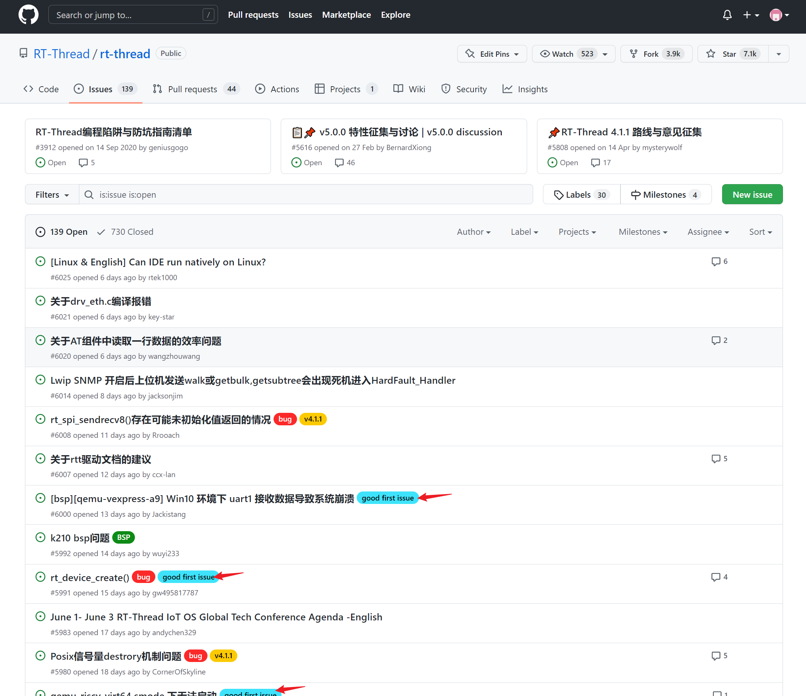

这里面有很多问题和话题，如果自己没有目标的话可以先逛一逛，看一看哪些问题自己感兴趣或者能解决。这样初步的一个目标就可以定下来了。而对于小白来说，可以先看看 "[good first issue](https://github.com/RT-Thread/rt-thread/issues?q=is%3Aissue+is%3Aopen+label%3A%22good+first+issue%22)" 标签分类下的 issue，随便点一下上面蓝色的标签就可以看到全部该标签下的 issue（这一类的 issue 更适合刚入门的开源小白）。或者有自己的想法也可以，选好目标，就可以开始做啦。

我这次主要是做的文档完善相关的贡献，首先体验一下整个 PR 过程。


## 如何修改内容？

首先要将官方仓库 fork 到我们自己的仓库下，点击一下 Fork 按钮，按照提示操作就可以 Fork 完成了。

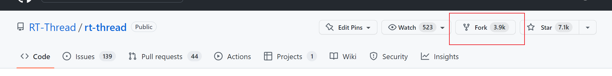

然后在自己的仓库里就可以看到刚刚 fork 过来的 rt-thread ：

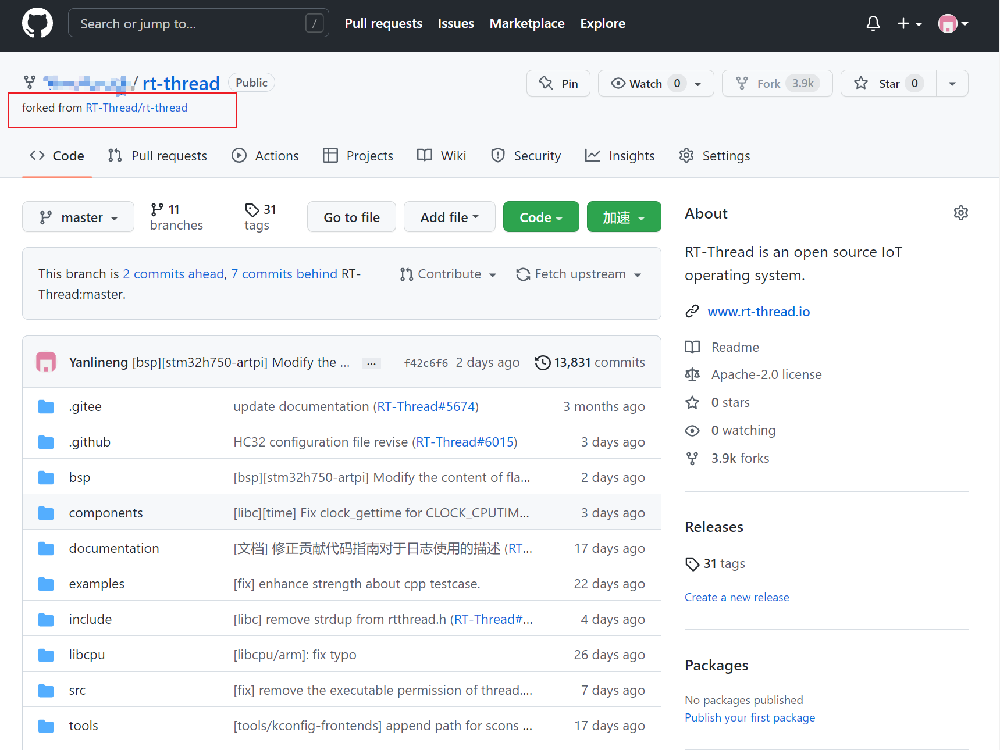

接着点击 Code 按钮，使用 SSH 方式 克隆到本地，首先复制一下 ssh 的链接。

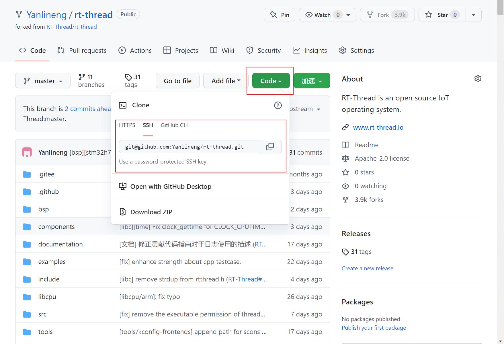

在本地PC上，选择一个合适的目录，点击右键打开 Git Bash Here ，进入 git 命令行工具后使用 `git clone` 命令克隆仓库到本地：

```bash
git clone [刚刚复制的ssh链接]
```

**ps：** 这里建议配置一下 github 的 ssh 连接方式（[参考](https://jingyan.baidu.com/article/3f16e003ec2f6c6490c10358.html)），以后每次 拉取或推送 修改到自己的仓库时就不需要输入密码了。去年 github 更新过关于 ssh 的使用，ssh 密钥的生成方式最好按照[官方教程](https://docs.github.com/cn/authentication/connecting-to-github-with-ssh/generating-a-new-ssh-key-and-adding-it-to-the-ssh-agent)去生成 ed25519 密钥，其他步骤都不变。

克隆完成后，就可以在本地目录下看到整个仓库的内容，这个作为本地仓库（其实就是 github 上远程仓库的一个分身），我们的修改都先保存在本地仓库，接着使用相关命令就可以 push 到关联的远程仓库啦。

接着按照我们的需要修改本地仓库里面的内容就行。 


## 如何提交修改？

完成修改后，在本地仓库目录下 打开 git bash 命令行界面。

1.  查看状态

    输入 `git status` 命令可以查看当前本地仓库的状态，比如哪些文件是新添加的(new)、哪些文件修改过(modified)。

2.  添加修改

    使用 `git add + [filename]  ` 可以添加当前filename文件的修改（依据 git status 中显示的信息逐步添加自己需要的修改）， `git add .` 则是添加全部修改。

    如果需要添加一些 被 git 默认忽略的文件类型，使用 `git add -f [filename]` 即可。

3.  提交到本地仓库

    使用 `git commit -m “[对本次提交的一些描述性的话语]”` , 即可提交本次修改到本地仓库。

4.  提交到远程仓库

    如果是通过 ssh 方式 克隆下来的， 应该已经默认添加了自己的远程仓库地址。

    可以通过 `git remote -v` 查看一下，是否有自己的远程仓库地址。如果没有的话，可以通过 `git remote origin [远程仓库地址]` 添加一下。

    

    接着使用 `git push origin master ` （本地的分支是master, 可以更换）, 即可将刚刚的commit 从本地仓库推送到到远程仓库。

5.  然后在 github 上查看自己的仓库，应该就能看到刚刚 commit 的内容，点进 commit 可以看到一些修改内容，在这次里面我主要修改了一些文档内容，并且添加了一个新文件。

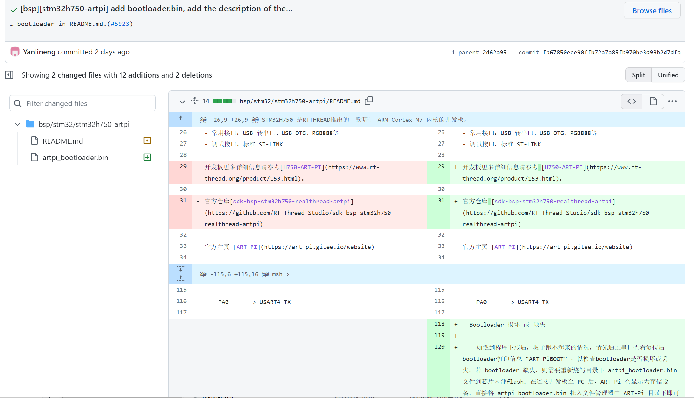

观察这个对比图，是可以看见我做的一些修改的，包括删除和添加。

到这里已经把本次修改提交到 自己的 github 仓库了。


## 如何 Pull Request (PR) ？

**PR** - **Pull Request** , 所谓提交自己的 PR ，其实就是**申请**官方仓库**拉取**自己的代码 合并到仓库中。

直观一点，就是我自己修改了官方的代码或者文档，现在我想将这些修改合并到官方仓库中。也就是为开源项目做贡献的最后一步，一旦 PR 成功，我们也就完成了这一部分的开源贡献。

从之前的步骤可以知道，我们自己 github仓库 中的 rt-thread 是从官方仓库 fork 来的，并且前面我们已经 commit 修改到自己的仓库了，现在我们在自己仓库里的 rt-thread 中点击提交 PR ， 点击图中的 New pull request 按钮。

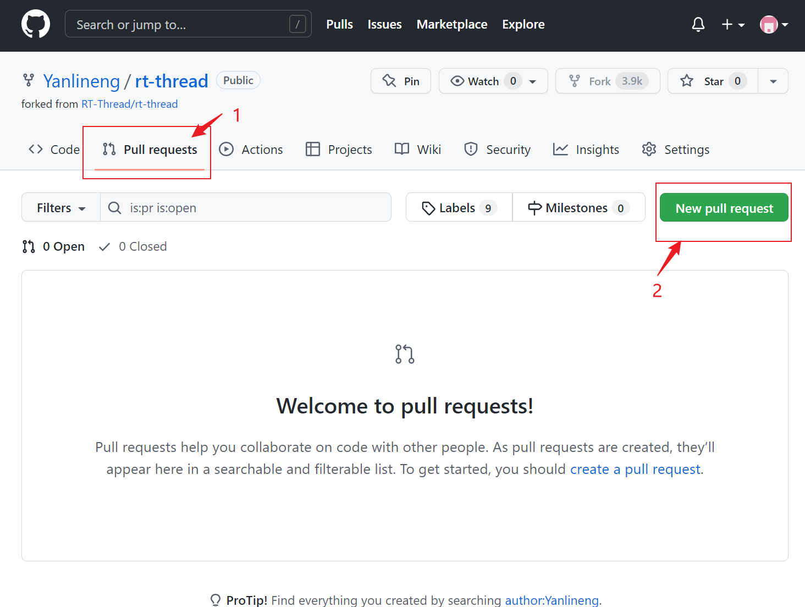

可以看到我们已经跳转到官方仓库了，然后在下方可以看到在自己仓库里的几次 commit 。接着点击右边绿色的 Create pull request 按钮。

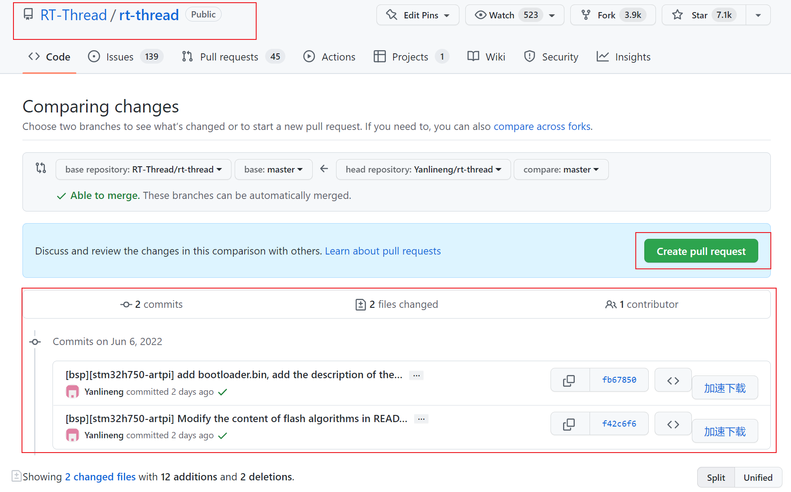

跳转到一个详细页面，在上方也能看到我们希望自己仓库的 master 分支合并到 官方仓库的 master 分支；在下面编辑框我们需要填写一些必要信息，这个参考说明如实填写即可。最后继续点击 Create pull request。

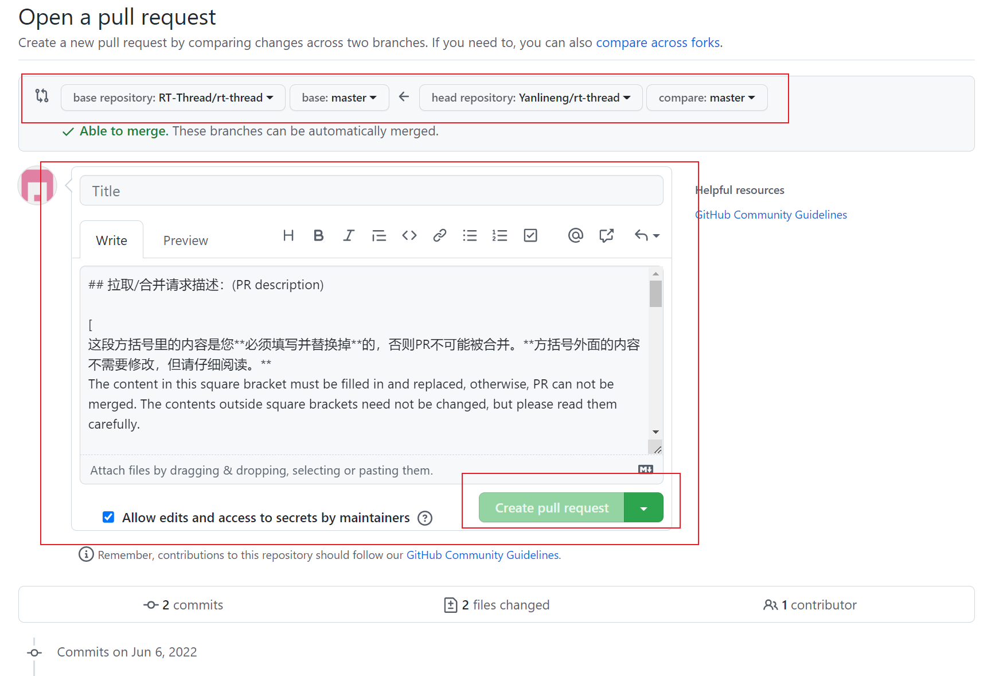

到这里，这次 PR 过程就算开启了，在官方仓库的 [Pull requests 选项页](https://github.com/RT-Thread/rt-thread/pulls) 也可以看到自己的 PR 正在流程中。

第一次 PR 的贡献者还需要在 PR 界面接受一下 CLAassistant 的贡献者许可。

然后等待自动化审查代码过程，等待管理员的人工审核即可。

如果顺利的话，最终 PR 能够被认可，那么我们的修改就可以合并到官方仓库了！


## 额外的一些话题

### 1. 如果我们是针对 一个 issue 进行的贡献，在我提交 PR 后如何和这个 issue 关联起来，让提出者快速看到？

在这里我们可以先看到 issue 界面，点进相关的 issue 可以看到 标题右边有一个 “#”+ 序号，这个就是一个事件的识别号，在 github 上，同一个仓库里 使用这个序号可以定位到唯一地方。

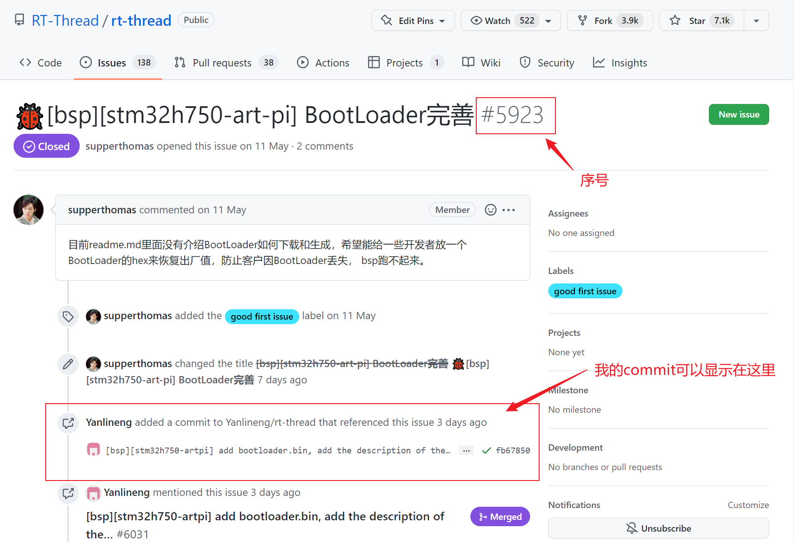

我的 commit 活动或者 PR 活动能显示在这里 ，是因为我在 commit描述 或 PR 描述中加入了 #5923 ，github 会自动识别并关联。

当然我们也能在各个能够评论的地方 输入相关形式序号，就可以自动关联到相关的事件上。


### 2. PR 过程中，发现之前的commit有错误，需要修改怎么办？

在 PR 过程中，如果我们检查发现之前的 commit 有问题，需要进行修改，先不要着急关闭 PR。因为在 PR 过程中，我们可以多次 commit 到自己仓库的提交 PR 的分支（我这里之前是 master 分支），并且这些 commit 是会被 PR 过程自动同步进来的，也就是说 PR 过程中 我们可以提交多次 commit ，都是会推送到 PR 中的。

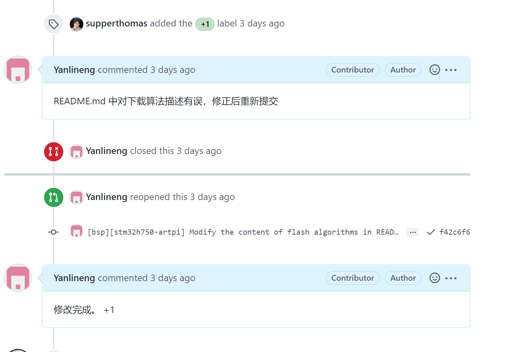

我这里之前发现错误想修改，就自己关闭了 PR，其实不需要，后面继续 commit 修改内容就行。

这应该也是为了方便 PR 过程中， 为管理员 与 开发者能够修改 commit 提供一些灵活性。遇到一些小问题，小bug 时，不必要关闭 PR 重来，而是继续提交即可。

在 PR 过程中，也可以看到整体的修改效果，也就是说多次 commit 会整合在一起，查看 PR 过程最新的修改情况。如下图，点击 PR 界面的 Files changed ，修改一下设置就可以看到对比图了。

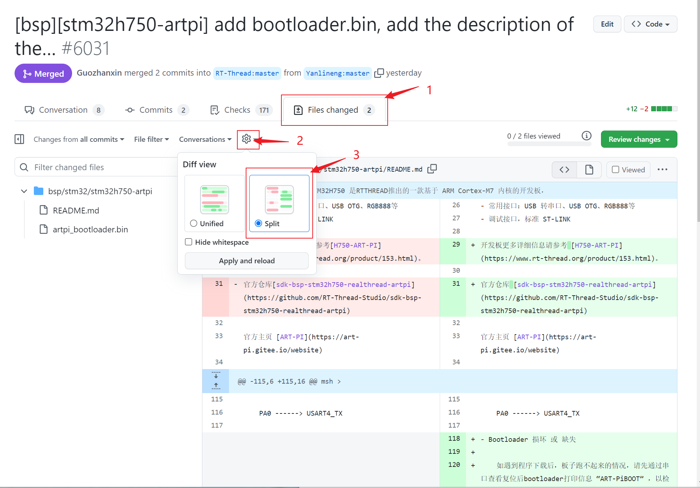


### 3. 关于分支的一些问题

在这次贡献过程中，我 fork 完官方仓库中的 rt-thread 后，拉取自己仓库的 rt-thread 到本地，此时默认只有 master 主分支，并且在修改完成以后 commit 到了 master 分支。其实这样是不明智的。

可以设想一下如果我们需要同时进行很多功能的开发，也是同时在 master 一条分支上进行修改。那么很大可能会将 master 分支上代码置于错误的状态，虽然 git 工具支持版本回滚，但这过程中又会造成其他问题。

我这次只是做了一次简单修改，确实不会导致很严重的后果，但是这种风险是存在的。

因此最好在每一项修改需求开始的时候，新建一个属于此次修改目的的分支，与主分支 master 隔离开来，这样的话无论怎样在新分支上进行修改，也基本不会影响到 主分支 master 上的代码状态，总是能保持 master 分支上的正确运行。待到修改完成，并测试成熟以后，再合并此分支到主分支上，基于此能进行多分支的需求开发啦。

对分支的理解参考 [git分支有什么用](https://zhidao.baidu.com/question/685883096733704732.html)


## 结语

第一次 PR 成功多少还是有一些兴奋感，看到自己的提交能合并到官方仓库中是很开心的。回顾之前为什么没有参与到开源中来，主要还是觉得开源贡献应该有多大的难度、有多大的工作量，觉得自己能力不够。其实不然，开源项目中有很多细节需要开发者去完善，这些工作任务或难或易，大家依据自己能力或时间选择即可。开源的宗旨也不是以某些硬性条件作为标准，而是每个人都可以为开源项目贡献内容，贡献活跃，贡献力量。


有兴趣的小伙伴也可以看看这个链接 [如何给RT-Thread提交 PR](https://github.com/RT-Thread/rt-thread/pull/5890) ，里面有官方的 PR 视频教程 [从0教你如何给RT-Thread贡献代码](https://www.bilibili.com/video/BV1gr4y1w7yX?vd_source=9555706f084634f81c3c7f07e454b45a) 。